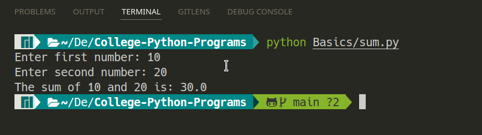

# Python Programs

## 1. Sum of two numbers
```python
num1 = input('Enter first number: ')
num2 = input('Enter second number: ')

sum = float(num1) + float(num2)

print('The sum of {0} and {1} is: {2}'.format(num1,num2, sum))
```
### Output
